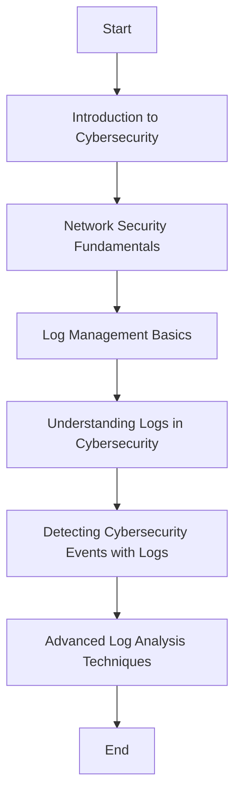

Files in these directories will be listed in reverse chronological order.
`THIS IS WHERE WE COULD STORE LEARNING MODULES OR WHATEVER CONTENT WE WANTED`

```mermaid
graph TD;
    A[Start] --> B[Introduction to Cybersecurity];
    B --> C[Network Security Fundamentals];
    C --> D[Log Management Basics];
    D --> E[Understanding Logs in Cybersecurity];
    E --> F[Detecting Cybersecurity Events with Logs];
    F --> G[Advanced Log Analysis Techniques];
    G --> H[End];
```
